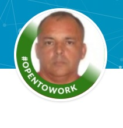

## :books:Projetos Concluídos:books:

### *Daniel Cerri Ribeiro*

##   

#### **Olá bem vindo... aos meus Projeto do BootCamp** 

**Projetos realizados BootCamp Inter Developer** :computer:

-----------------------------------------------------

- _**[Digital Inovation One](https://web.digitalinnovation.one/)**_
- **BootCamp Inter Developer**

-----------------------------------------------------

`copyright © Daniel 2021`

Executar dínamo:

java -Djava.library.path =. / DynamoDBLocal_lib -jar DynamoDBLocal.jar -sharedDb

aws dynamodb list-tables - endpoint-url [http: // localhost: 8000](http://localhost:8000/)

swagger: [http: // localhost: 8080 / swagger-ui-heroes-reactive-api.html](http://localhost:8080/swagger-ui-heroes-reactive-api.html)